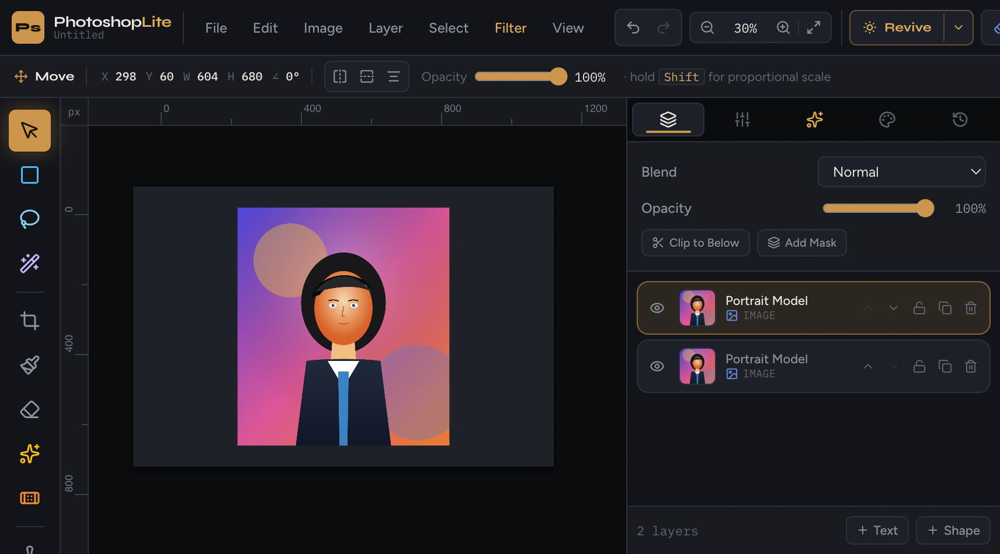
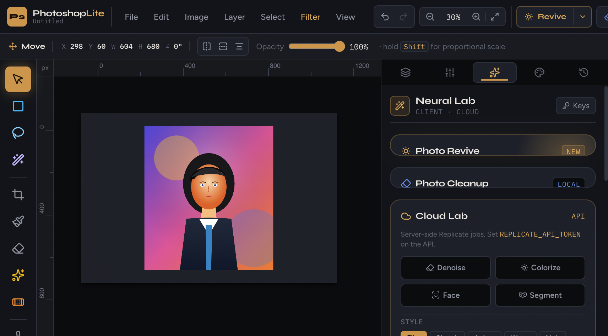
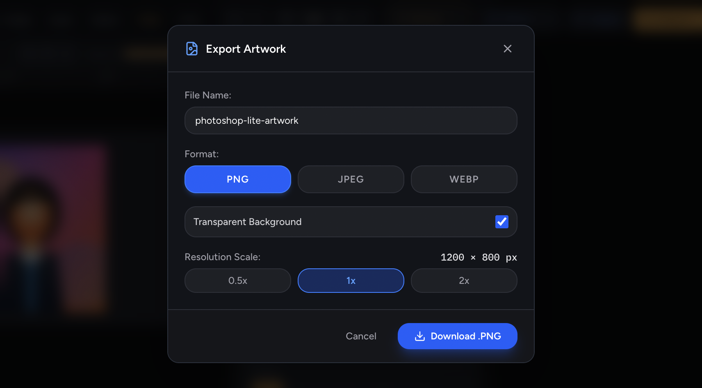

# PhotoshopLite

Browser darkroom editor — layers, retouch tools, local Neural Lab, and optional cloud AI via a NestJS proxy.

<p align="center">
  
</p>

## Screenshots

| Workspace | Neural Lab | Export |
| --- | --- | --- |
|  |  |  |

## Features

- **Canvas** — Konva stage with layers, marquee / lasso / wand, brush, heal, clone, shapes, text
- **Local AI** — Photo Revive, Cleanup, WASM cutout, client upscale
- **Cloud Lab** — Denoise, colorize, face restore, inpaint, style, segment, caption (Replicate via API)
- **Projects** — `.pslite` local save + Save to Cloud / Open from Cloud (`apps/api/data/workspaces/{id}`)
- **Workspace isolation** — each browser gets `X-Workspace-Id` so person A never overwrites person B
- **API cache** — Nest `CacheModule` for project lists/details, assets list, and fonts catalog
- **Export** — PNG / JPEG / WEBP with transparent background and scale

## Quick start

```sh
# Editor (http://127.0.0.1:4200)
npm run dev

# API (http://127.0.0.1:3001) — optional for Cloud Lab / cloud projects
cp .env.example .env   # set REPLICATE_API_TOKEN if needed
npm run api
```

| Script | What it does |
| --- | --- |
| `npm run dev` | Vite editor on port `4200` |
| `npm run api` | NestJS AI + projects/assets API |
| `npm run build` | Production editor bundle |
| `npm run test:api` | API unit tests |
| `npm run test:core` | Editor-core unit tests |

## Environment

See [`.env.example`](.env.example):

- `REPLICATE_API_TOKEN` — server-side Replicate key for Cloud Lab
- `REMOVE_BG_API_KEY` — optional remove.bg
- `DATA_DIR` — projects/assets root (default `apps/api/data`)
- `PORT` — API port (default `3001`)
- `VITE_SITE_URL` — public origin for SEO (canonical, Open Graph, `sitemap.xml`, `robots.txt`)

Client API keys in Settings remain an optional override; server env keys are preferred.

## SEO

Production editor ships with:

- Rich meta / Open Graph / Twitter cards in `apps/editor/index.html`
- JSON-LD (`WebApplication` + `WebSite`)
- `public/sitemap.xml`, `public/robots.txt`, `public/site.webmanifest`
- `og-image.png` (1200×630)

Set `VITE_SITE_URL` before `npm run build` so absolute URLs match your deploy host.

## Monorepo layout

```
apps/editor          React editor (Konva + Zustand)
apps/api             NestJS AI proxy + local projects/assets
libs/ai              Replicate / remove.bg engine
libs/editor-ai-client  Fetch client + poll helpers
libs/editor-core     Pixel ops, project file, masks
libs/shared/types    Shared DTOs
```

## Architecture (AI + storage)

```
Editor Neural Lab → editor-ai-client (+ X-Workspace-Id) → NestJS /api
  → AiEngineService → Replicate / remove.bg
  → ProjectsService / AssetsService → data/workspaces/{workspaceId}/…
  → CacheService (in-memory TTL, workspace-scoped keys)
```

## License

MIT
